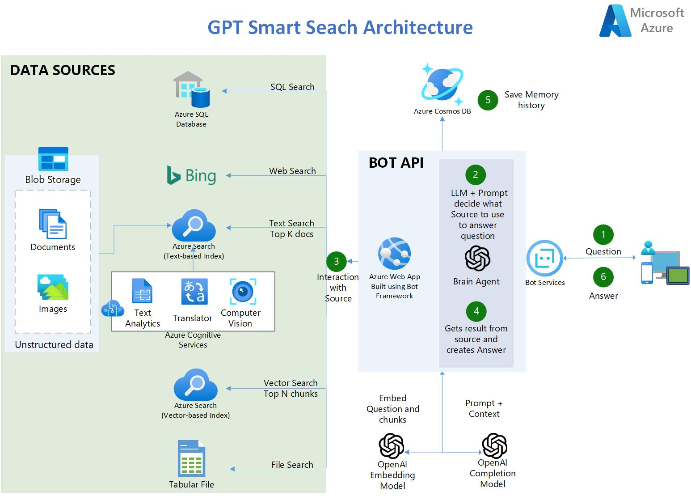

# Accelerator powered by Azure Cognitive Search + Azure OpenAI 
Your organization needs a search engine that can make sense of all kinds of types of data, stored in different locations, and that can return the links of similar documents, but more importantly, provide the answer to the question! In other words, you want private and secured ChatGPT for your organization that can interpret, comprehend, and answer questions about your business data.
The goal of the MVP workshop is to show/prove the value of a GPT Smart Search Engine built with the Azure Services, with your own data in your own environment. For more information on the 2 day workshop, click the powerpoint presentation below:

[Accelerator Pitch Deck](https://microsoft-my.sharepoint.com/:p:/p/jheseltine/Ee0OFL6hWNBCtRpoFRHIdj8BPGCzq01xTxkmEp0scLwSAg?e=EIz9is)

**Click "*view raw*" to view powerpoint presentation**

**Prerequisites Client 2-Day Workshop**
* Azure subscription
* Accepted Application to Azure Open AI
* Microsoft members need to be added as Guests in clients Azure AD
* A Resource Group (RG)  needs to be set for this Workshop POC, in the customer Azure tenant
* The customer team and the Microsoft team must have Contributor permissions to this resource group so they can set everything up 2 weeks prior to the workshop
* A storage account must be set in place in the RG. <b>Disable firewalls and enable public network access from all networks</b>
* Data/Documents must be uploaded to the blob storage account, at least two weeks prior to the workshop date
* Azure Machine Learning Workspace must be deployed in the RG
   * Note: Please ensure you have enough core compute quota in your Azure Machine Learning workspace 


# Architecture 


## Demo

https://pablomarin-gpt-azure-search-engine-apphome-oq98mn.streamlit.app

---

## 🔧**Features**

   - Shows how you can use [Azure OpenAI](https://azure.microsoft.com/en-us/products/cognitive-services/openai-service/) + [Azure Cognitive Search](https://azure.microsoft.com/en-us/products/search) to have a GPT powered Smart Search engine that not only provides links of the search results, but also answers the question by reading and understanding those search results.
   - ***Solve 80% of the use cases where companies want to use OpenAI to provide answers from their knowledge base to customers or employees, without the need of retraining/fine tuning and hosting the models.***
   - All Azure services and configuration are deployed via python code.
   - Uses [Azure Cognitive Services](https://azure.microsoft.com/en-us/products/cognitive-services/) to enrich documents: Detect Language, OCR images, Key-phrases extraction, entity recognition (persons, emails, addresses, organizations, urls).
   - Uses [LangChain](https://langchain.readthedocs.io/en/latest/) as a wrapper for interacting with Azure OpenAI , vector stores and constructing prompts.
   - Uses [Streamlit](https://streamlit.io/) to build the web application in python.
   - Multi-Lingual (ingests, indexes and understand any language)
   - Multi-Index -> multiple search indexes
   - Parses CSVs -> one-to-many documents (one row is an indexed document)
   - Tabular Data Q&A in CSV files and SQL Databases using GPT-4
   - (Coming soon) Chat Interface
   - (Coming soon) Recommends new searches based on users' history.
   - (Coming soon) Multi-Source (Blob Storage + SQL DB, CosmosDB, Sharepoint, etc)

---

## **Steps to Run the Accelerator**

Note: (Pre-requisite) You need to have an Azure OpenAI service already created

1. Fork this repo to your Github account.
2. In Azure OpenAI studio, deploy these two models: **Make sure that the deployment name is the same as the model name.**
   - "gpt-35-turbo" for the model "gpt-35-turbo (0301)". If you have "gpt-4", use it (it is definitely better)
   - "text-embedding-ada-002"
3. Create a Resource Group where all the assets of this accelerator are going to be. Azure OpenAI can be in different RG or a different Subscription.
4. ClICK BELOW to create an Azure Cognitive Search Service and Cognitive Services Account:

[](https://portal.azure.com/#create/Microsoft.Template/uri/https%3A%2F%2Fraw.githubusercontent.com%2Fpablomarin%2FGPT-Azure-Search-Engine%2Fmain%2Fazuredeploy.json) 

_Note: If you have never created a cognitive multi-service account before, please create one manually in the azure portal to read and accept the Responsible AI terms. Once this is deployed, delete this and then use the above deployment button._

5. Enable Semantic Search on your Azure Cognitive Search Service:
   - On the left-nav pane, select Semantic Search (Preview).
   - Select either the Free plan or the Standard plan. You can switch between the free plan and the standard plan at any time.
6. Make sure you run the notebooks on a Python 3.10 conda enviroment
7. Install the dependencies on your machine (make sure you do the below comand on the same conda environment that you are going to run the notebooks:
```
pip install -r ./requirements.txt
```
8. Run 01-Load-Data-ACogSearch.ipynb:
  - Loads 9.8k PDFs into your Search Engine and create the first index with AI skills
9. Run 02-LoadCSVOneToMany-ACogSearch.ipynb and:
  - Ingests 52k documents into your Search Engine coming from 1 CSV file
10. Run 03-Quering-AOpenAI.ipynb:
   - Run queries in Azure Cognitive Search and see how they compare with enhancing the experience with Azure OpenAI
11. Go to the app/ folder and click the Deploy to Azure function to deploy the Web Application in Azure Web App Service. It takes about 15-20 minutes.
   - The deployment automatically comes with CI/CD, so any change that you commit/push to your github forked repo will automatically trigger a deployment in the web application.

---

## **FAQs**

1. **Why the vector similarity is done in memory using FAISS versus having a separate vector database like RedisSearch or Pinecone?**

A: True, doing the embeddings of the documents pages everytime that there is a query is not efficient. The ideal scenario is to vectorize the docs chunks once (first time they are needed) and then retrieve them from a database the next time they are needed. For this a special vector database is necessary. The ideal scenario though, is Azure Search to retreive the vectors as part of the search results, along with the document chunks. Azure Search will soon allow this in a few months, let's wait for it. As of right now the embedding process doesn't take that much time or money, so it is worth the wait versus using another database just for vectors.

2. **Why use the MAP_REDUCE type in LangChaing versus STUFF type?**

A: Because using STUFF type with all the content of the pages as context, uses too many tokens. So the best way to deal with large documents is to find the answer by going trough all of the search results and doing many calls to the LLM looking for summarized answer. For more information of the difference between STUFF and MAP_REDUCE, see [HERE](https://github.com/hwchase17/langchain/tree/master/langchain/chains/question_answering)

3. **Why use Azure Cognitive Search engine to provide the context for the LLM and not fine tune the LLM instead?**

A: Quoting the [OpenAI documentation](https://platform.openai.com/docs/guides/fine-tuning): "GPT-3 has been pre-trained on a vast amount of text from the open internet. When given a prompt with just a few examples, it can often intuit what task you are trying to perform and generate a plausible completion. This is often called "few-shot learning.
Fine-tuning improves on few-shot learning by training on many more examples than can fit in the prompt, letting you achieve better results on a wide number of tasks. Once a model has been fine-tuned, you won't need to provide examples in the prompt anymore. This saves costs and enables lower-latency requests"

So training/fine tunning the model requires that we provide hundreds/thousands of Prompt and Completion tuples, or in other words, we need to provide samples of query-responses. For a company knowledge base of Terabytes of information this is not feasible. To come up with all the possible tuples that users my request, is simply not possible. So the search engine is absolutely necessary for a company data search engine using OpenAI.

---

## **Known Issues**

1. **Error when sending question: "This model's maximum context length is 2047 tokens, however you requested xxxx tokens (xxxxx in your prompt; 0 for the completion). Please reduce your prompt; or completion length"**

This error happens if your embedding model *text-embedding-ada-002* has a limit of 2047 max tokens. Older versions of this model in Azure OpenAI has this reduced limit. However the newer versions have the 8192 limit. Make sure you request the newer version, or if not possible, reduce the size of the TextSplit in Azure Search indexing from 5000 (default) to 3500.


