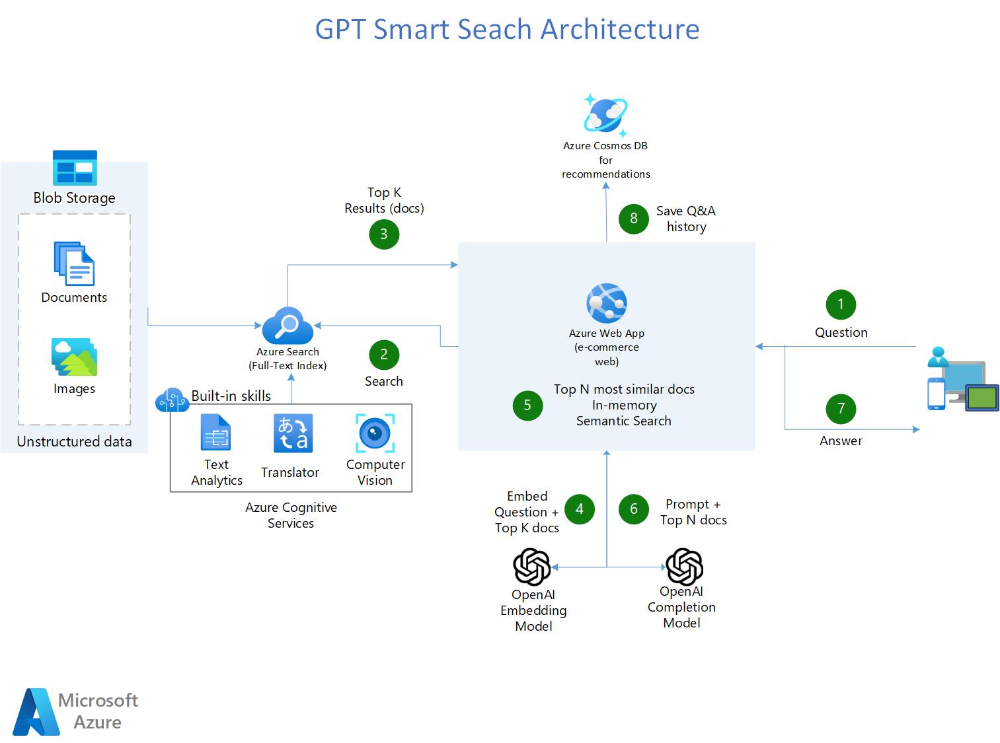

# GPT-Azure-Search-Engine 
### (Azure Cognitive Search + Azure OpenAI Accelerator)



## 🔧**Features**

- Shows how you can use [Azure OpenAI](https://azure.microsoft.com/en-us/products/cognitive-services/openai-service/) + [Azure Cognitive Search](https://azure.microsoft.com/en-us/products/search) to have a Smart and Multilingual Search engine that not only provides links of the search results, but also answers the question.
- ***Solve 80% of the use cases where companies want to use OpenAI to provide answers from their knowledge base to customers or employees, without the need of retraining and hosting the models.***
- All Azure services and configuration are deployed via python code.
- Uses [Azure Cognitive Services](https://azure.microsoft.com/en-us/products/cognitive-services/) to enrich documents: Detect Language, OCR images, Key-phrases extraction, entity recognition (persons, emails, addresses, organizations, urls).
- Uses [LanChain](https://langchain.readthedocs.io/en/latest/) as a wrapper for interacting with Azure OpenAI , vector stores and constructing prompts.
- Uses [Streamlit](https://streamlit.io/) to build the web application in python.
- (Coming soon) recommends new searches based on users' history.

## **Steps to Run the Accelerator**

Note: (Pre-requisite) You need to have an Azure OpenAI service already created

1. Clone this repo to your Github account.
2. In Azure OpenAI studio, deploy these two models: Make sure that the deployment name is the same as the model name.
  - "text-davinci-003"
  - "text-embedding-ada-002"
3. Create a Resource Group where all the assets of this accelerator are going to be.
4. Create an Azure Cognitive Search Service and Cognitive Services Account by clicking below: \<br\>

[](https://portal.azure.com/#create/Microsoft.Template/uri/https%3A%2F%2Fraw.githubusercontent.com%2Fpablomarin%2FGPT-Azure-Search-Engine%2Fmain%2Fazuredeploy.json) 

_Note: If you have never created a cognitive multi-service account before, please create one manually in the azure portal to read and accept the Responsible AI terms. Once this is deployed, delete this and then use the above deployment button._

5. Enable Semantic Search on your Azure Cognitive Search Service:
  - On the left-nav pane, select Semantic Search (Preview).
  - Select either the Free plan or the Standard plan. You can switch between the free plan and the standard plan at any time.
6. Install the dependencies on your machine:
```
pip install -r ./requirements.txt
```
7. Edit app/credentials.py with your azure services information
8. Run 01-Load-Data-ACogSearch.ipynb:
  - Loads data into your Search Engine and create the index with AI skills
9. Run 02-Quering-AOpenAI.ipynb and:
  - Run queries in Azure Cognitive Search and see how they compare with enhancing the experience with Azure OpenAI
10. Go to the app/ folder and click the Deploy to Azure function to deploy the Web Application in Azure Web App Service. It takes a few minutes.
  - The deployment automatically comes with CI/CD, so any change that you commit/push to the code will automatically trigger a deployment in the Application.

